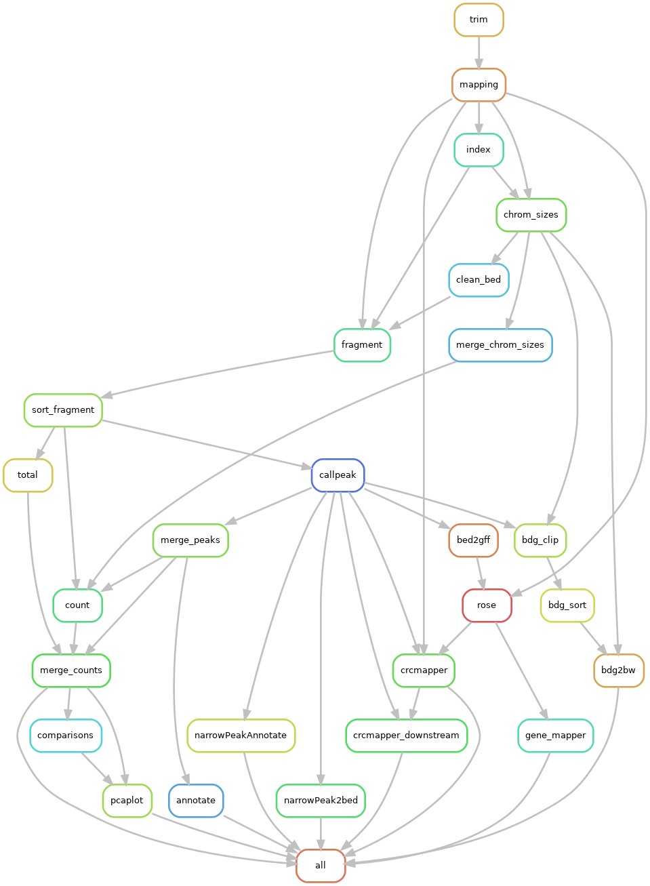

**depipe** 是一个自动化的 ChIP-Seq 分析流程，在完成配置后，可以自动进行可复现、高并行的 ChIP-Seq 数据分析。

## 流程总览



## 依赖安装

使用 [mamba](https://mamba.readthedocs.io/) 自动安装所有依赖

```bash
mamba env create -f environment.yml
conda activate depipe
```

## 运行流程

首先需要创建一个本次分析的配置文件

```bash
mkdir project
cd project
cp dapipe/config.yaml .
```

浏览检查配置文件内的所有配置项（所有配置项都是必须的），并按照注释进行更改。然后运行流程

```bash
snakemake --snakefile dapipe/Snakefile -j 10 --configfile config.yaml -- all
```

其中的 `-j` 是允许流程使用的最大进程数。注意最后的位置参数 `all`，使用这个 rule 代表运行所有的流程，包括富集差异、超级增强子以及核心转录因子。可选的流程有 `basic_all` 仅进行 peak calling；`compare_all` 进行富集差异分析；`rose_all` 分析超级增强子了；`crcmapper_all` 分析核心转录因子。不同的流程可以相互组合。
